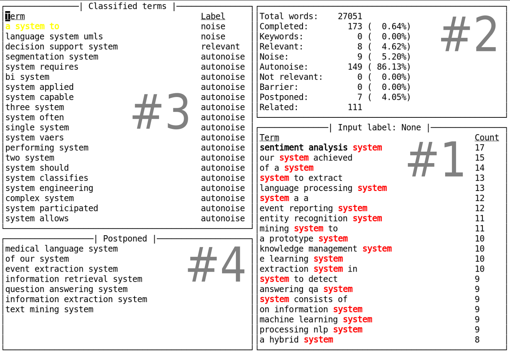

# `FAWOC` the FAst WOrd Classifier

FAWOC is a TUI program for manually labelling a list of words.
It has been developed to support the efficient clustering of documents based on topic modeling algorithms such as Dirichlet Latent Allocation.



The programs reads a CSV file containing the terms and allows the fast association of labels to the terms.

Each term is presented to the user, who can associate to the term one of the labels with the press of a key.

Some statistics are provided in the user interface to have a clue about the number of classified terms and the remaining ones.

The terms are sorted according to their frequency in the set of documents, which is a value that must be made available to FAWOC.

## Example of usage

```
fawoc terms.csv
```

The input file `terms.csv` needs to have at least one column with the header (first column) called `term`.

## Available commands and keybindings

The following labels are currently supported:

* k keyword
* n noise
* r relevant
* x not-relevant
* s stopword
* p postponed
* a autonoise

Other keys allow to save and quit:

* w save immediately
* q quit

FAWOC automatically saves the changes on closing.
Moreover, it autosaves the changes every 10 classified words.

## Logging

FAWOC writes profiling information into the file `profiler.log` with the relevant operations that are carried out.

## Files

FAWOC reads the terms from a tsv file with the following structure:

* `id`: identification number of the term. Must be unique. For backward compatibility this column may be missing. In this case, FAWOC assigns an id to each term that will be saved in a newly created column `id` on the first save;
* `term`: the term itself. For backward compatibility with old files, this column can be called `keyword`. This name is deprecated, and FAWOC will change it to `term` on the first save;
* `label`: a string describing the label assigned to the term.

FAWOC will load other information from two service files.
These files are named after the input file, by removing its extension, adding the suffix `fawoc_data` and then adding the proper extension.
The service files are:

* `*_fawoc_data.tsv`: it contains static information about each term. It is saved only on FAWOC closing. Currently, it is used to load the number of occurrences of each term;
* `*_fawoc_data.json`: it contains information used by FAWOC to correctly handle the undo command.

The `--no-info-file` command line option can be used to tell FAWOC to not load (and save) the `*_fawoc_data.tsv`.
With this option, FAWOC will not display the count value.

### `*_fawoc_data.tsv`

The format of this tsv file is:

* `id`: identification number of the term;
* `term`: the term itself. This field is not directly ised by FAWOC, and it is here only the make this file more readable;
* `count`: the number of occurrences of the term.

For backward compatibility with old files, if the `*_fawoc_data.tsv` file is missing, FAWOC searches for the `count` column in the input file.
If this column is found, then FAWOC will use this value, otherwise the value -1 will be used.
A new file `*_fawoc_data.tsv` is created on the first save with the loaded values of `count`.

### `*_fawoc_data.json`

The format of this JSON file is a dictionary.
The keys of this dictionary are the id of the terms.
The values are dictionaries with the following format:

* `order`: number indicating the order in which each term is classified;
* `related`: related term selected at the moment the term is classified.

For backward compatibility with old files, if the `*_fawoc_data.json` is missing, FAWOC searches the `order` and the `related` fields in the input file.
If they are not found, then FAWOC will not be able to handle the undo of the classifications made before.
Each new classification will have its own entry in a newly created `*_fawoc_data.json`.